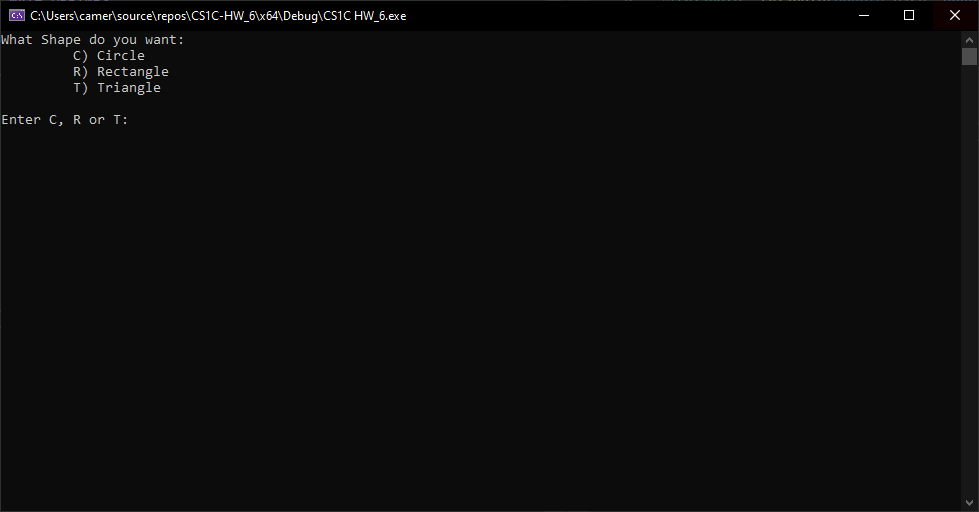

# Shape Class and Subclass Inheriance
## Summary
This program has a base Shape class with a default constructor and destructor, and has a pure virtual function, making Shape an abstract class. The pure virtual function will be used to create overridden functions for unique subclasses of Shape. The Circle, Rectangle, and Triangle class are all subclasses of shape and include the data members required to calculate the area of the class shape. This is done by redefining the virtual calcArea function on a class by class basis. The program will ask the user to choose a shape and will use the subclasses to create a dynamic object for the user to manipulate and find the area using the calcArea public member function and dynamically delete with each loop of the program.

## Current Build

## Shape Class
The Shape class has a default constructor and destructor, and a pure virtual function making Shape an abstract class. The pure virtual function will be used to create overridden functions for unique subclasses of Shape.

- [Shape.h](https://github.com/JusDooEt/Class-inheritance-example/blob/master/CS1C%20HW_6/Shape.h)
- [Shape.cpp](https://github.com/JusDooEt/Class-inheritance-example/blob/master/CS1C%20HW_6/Shape.cpp)
### Sub Classes
#### Rectangle
- [Rectangle.h](https://github.com/JusDooEt/Class-inheritance-example/blob/master/CS1C%20HW_6/Rectangle.h)
- [Rectangle.cpp](https://github.com/JusDooEt/Class-inheritance-example/blob/master/CS1C%20HW_6/Rectangle.cpp)

#### Circle
- [Circle.h](https://github.com/JusDooEt/Class-inheritance-example/blob/master/CS1C%20HW_6/Circle.h)
- [Circle.cpp](https://github.com/JusDooEt/Class-inheritance-example/blob/master/CS1C%20HW_6/Circle.cpp)

#### Triangle
- [Triangle.h](https://github.com/JusDooEt/Class-inheritance-example/blob/master/CS1C%20HW_6/Triangle.h)
- [Triangle.cpp](https://github.com/JusDooEt/Class-inheritance-example/blob/master/CS1C%20HW_6/Triangle.cpp)
